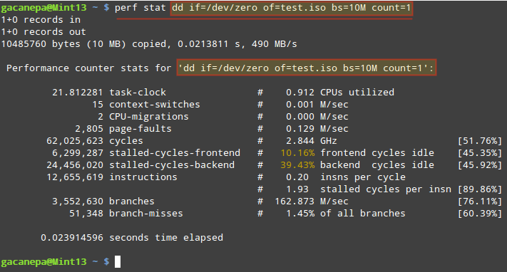

<h1>Trabalho disciplina Linguagens de Programação - UEM</h1>

<strong>gcc --version  ==  esse comando retornará a versão do compilador 
do sistema operacional.</strong>

<h2>Perfil de um programa</h2>

perf list sw == exibi lista de eventos pré-definidos

perf stat dd if=/dev/zero of=test.iso bs=10M count=1
 == executa um comando e coleta estatísticas de desempenho do Linux durante 
a execução do comando.

![img/dd-command.png]

perf record ./programa == gera perfil do programa

perf report == le os dados do perfil do programa

