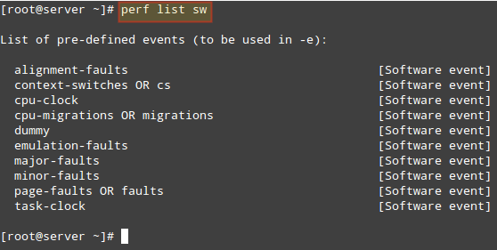

<h1>Trabalho disciplina Linguagens de Programação - UEM</h1>

<strong>gcc --version  ==  esse comando retornará a versão do compilador 
do sistema operacional.</strong>

<h2>Perfil de um programa</h2>

perf list sw == exibi lista de eventos pré-definidos

perf stat == Este comando fornece estatísticas globais para eventos
 de desempenho comuns, incluindo instruções executadas e
 ciclos de relógios consumidos. Você pode
 usar a opção de sinalizadores para reunir estatísticas de eventos além de
eventos de medição padrão.
 A partir do Red Hat Enterprise Linux 6.4 é possível usar perf status para filtrar monitoramento baseado em um ou mais grupos de controle especificados (cgroups). 

 

perf stat dd if=/dev/zero of=test.iso bs=10M count=1
 == executa um comando e coleta estatísticas de desempenho do Linux durante 
a execução do comando.

<h2>Comando Time</h2>

Ele é usado para determinar o tempo de execução de uma operação específica.

Ao final da execução aparecem três resultados:

<ul>
  <li>Real - se refere a tempo decorrido entre a execução e a conclusão do comando</li>
  <li>User - é o tempo gasto pelo usuário no processador</li
  <li>Sys - é o tempo usado pelo sistema (Kernel)para executar o comando </li

</ul>

perf record ./programa == gera perfil do programa

perf report == le os dados do perfil do programa

